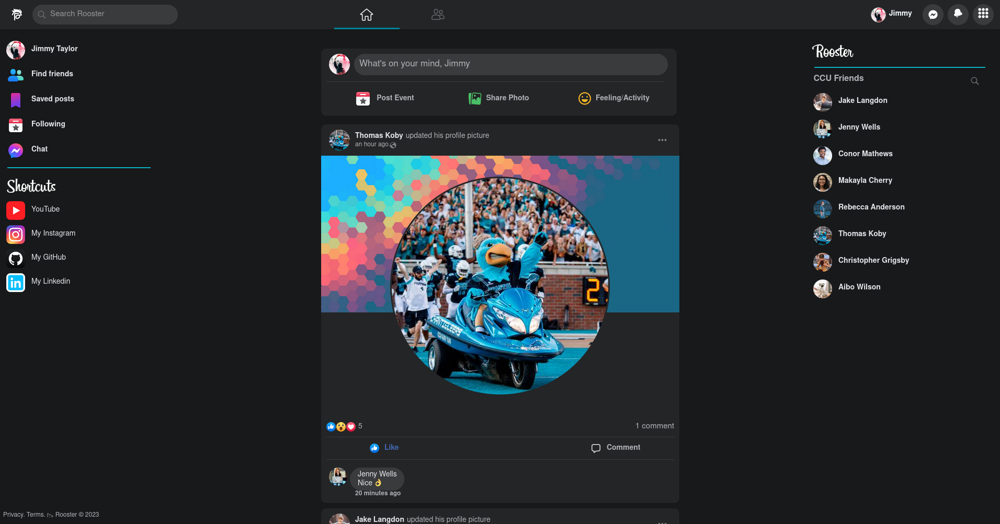
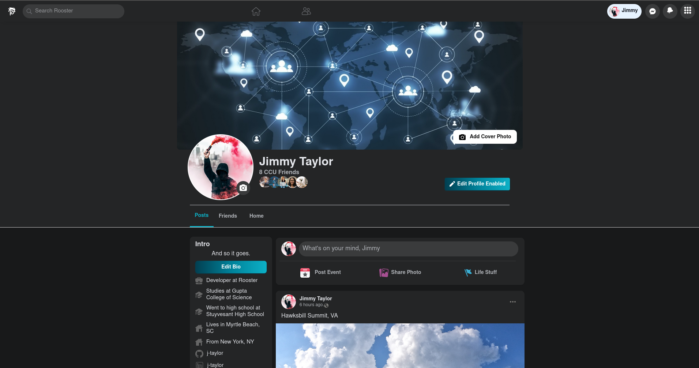
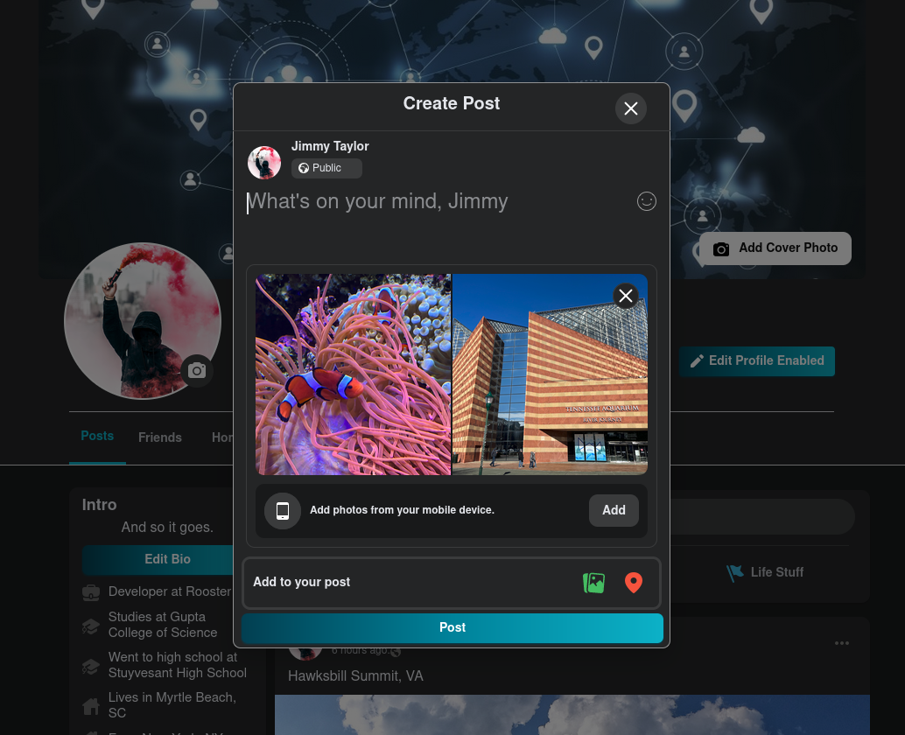
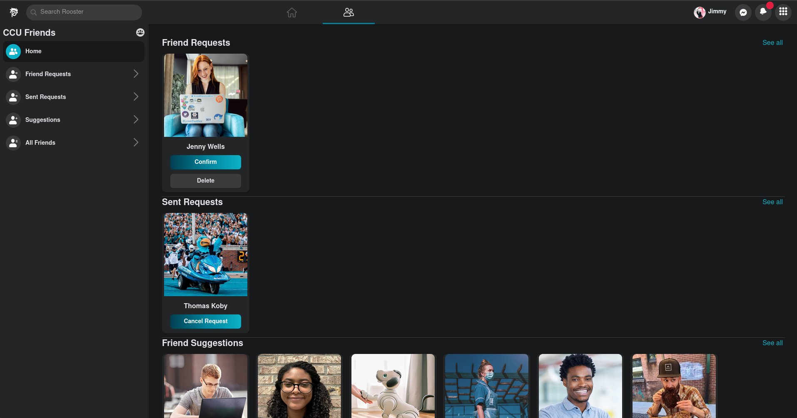

<div align="center" markdown="1">


# Rooster Frontend

[](https://badge.fury.io/js/react)
[](https://app.netlify.com/sites/rooster-social/deploys)


</div>

This client-side application is the frontend for Rooster, a social networking site for the Coastal Carolina University (CCU) community 👌

## Demo

A live demo of the app can be found at [www.roostersocial.com](https://www.roostersocial.com/)

|                           Home Page                            |                           Profile Page                            |
| :------------------------------------------------------------: | :---------------------------------------------------------------: |
|  |  |

|                           Create Post                            |                           Friends Page                            |
| :--------------------------------------------------------------: | :---------------------------------------------------------------: |
|  |  |

---

## Project Specifications

- Developed with [React](https://github.com/facebook/create-react-app)
- Users required to have a valid @coastal.edu email address
- Create and share posts/images with friends & followers
- Post reactions, comments, save, download
- Customizable profile page
- Friend request, follow/unfollow, friend/unfriend
- Search & Search History for other users
- Signup and Login Process
- Account Verification
- Password Reset
- Dark Mode On/Off
- [Redux](https://redux.js.org/) to assit with state management
- Deployed to [Netlify](https://www.netlify.com/)
- Backend API communication for data persistence, retrieval, authentication & authorization services

## Getting Started

To install dependencies:

```
npm install
```

To run in development mode:

```
npm start
```

Open [http://localhost:3000](http://localhost:3000) to view in the browser.

To build the app for production to the `build` folder:

```
 npm run build
```

## Environment Variables

This application utilizes [dotenv](https://www.npmjs.com/package/dotenv) to host environment variables. For local utilization configure the following:

- REACT_APP_BACKEND_URL
- REACT_APP_DEFAULT_FRIEND_ID

## Contributing

Contributions are welcome! To contribute please contact 📫 rooster@roostersocial.com
